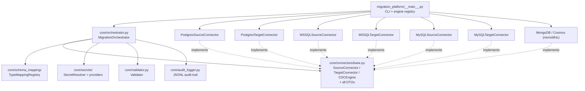
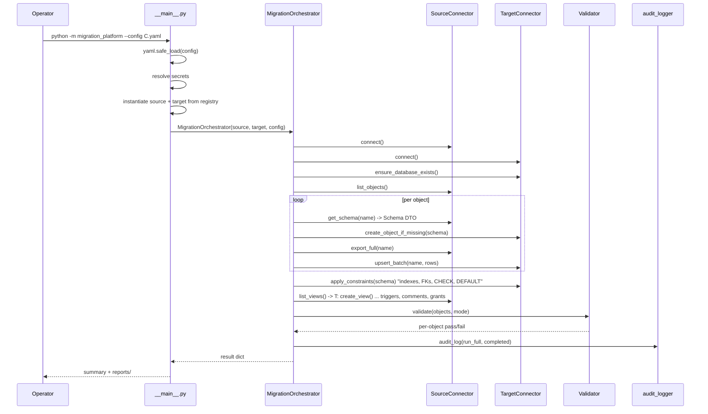
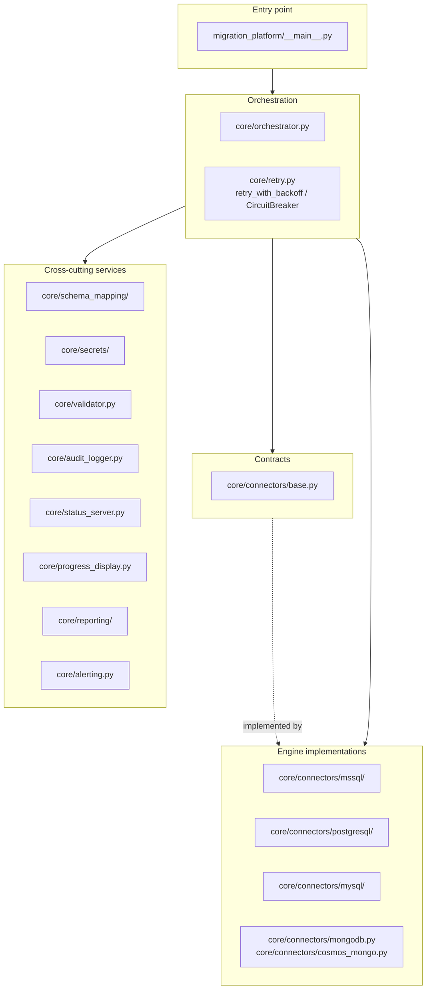
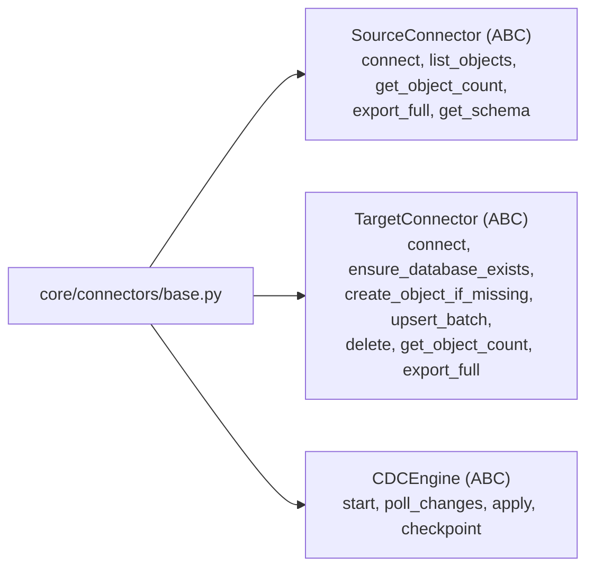
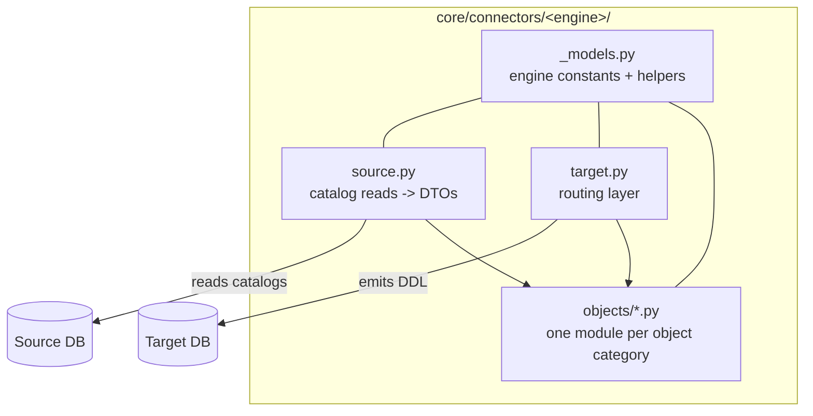
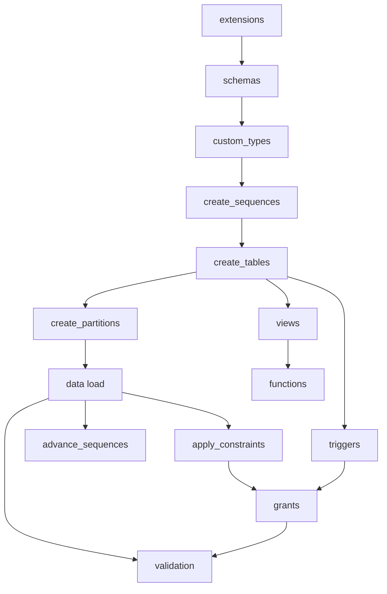
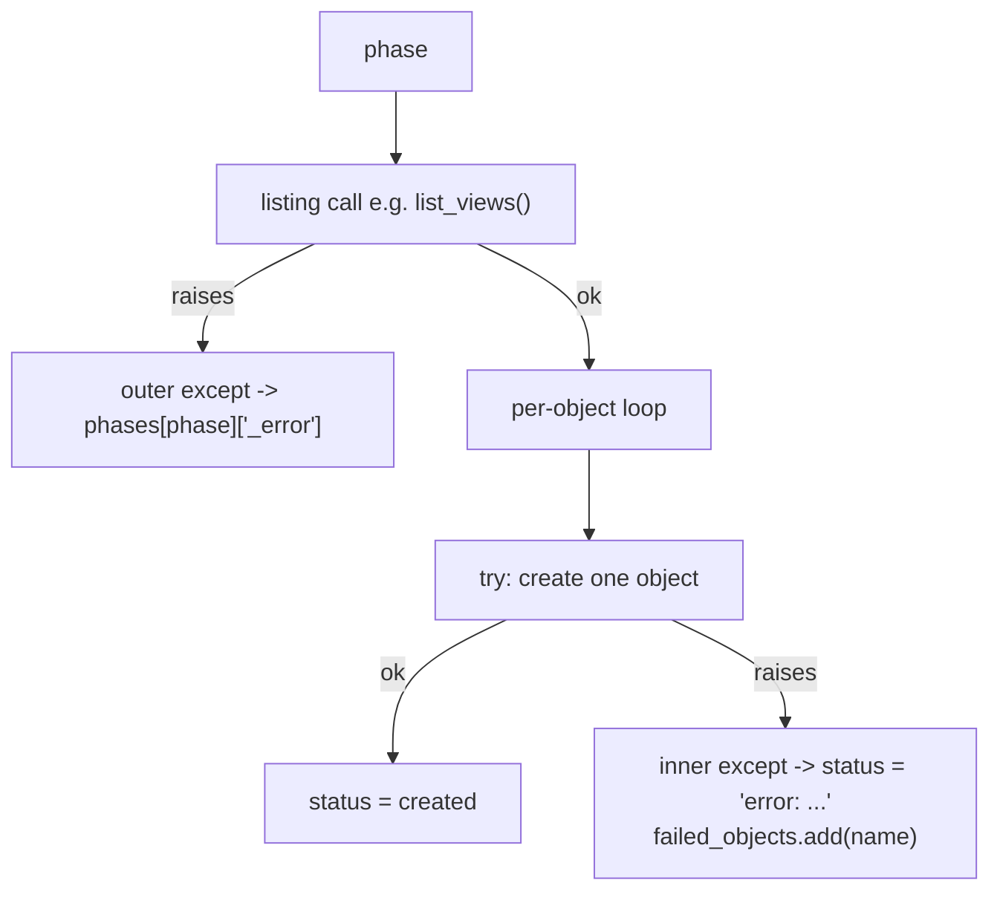
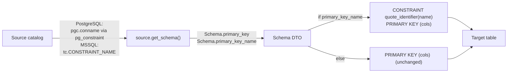

# Platform Architecture

**Status:** Authoritative description of the architecture as implemented.
**Branch:** `feature/platform-architecture`
**Frozen at:** `7322a20 fix(migration): preserve primary key constraint names`
**Scope of truth:** This document describes what exists in the repository today. Anything described as a capability is implemented and exercised. Anything described as a gap or extension point is not implemented and is not claimed to work.

> **How to read this document.** Sections 1-13 describe the architecture. Section 14 records what has actually been verified end-to-end. Sections 15-18 are the reference material (support matrix, extension recipes, decisions). Sections 19-20 are the honest inventory of what is missing and where the design deliberately leaves room.
>
> The older `docs/ARCHITECTURE.md` remains a short orientation document. Where the two disagree, **this document is correct** — it was written against the frozen tree. See [§19](#19-current-limitations--known-gaps) for the specific divergences.

---

## Table of Contents

1. [Architecture Overview](#1-architecture-overview)
2. [Design Goals](#2-design-goals)
3. [High-Level Platform Architecture](#3-high-level-platform-architecture)
4. [Repository / Package Structure](#4-repository--package-structure)
5. [Common / Base Layer](#5-common--base-layer)
6. [Connector Architecture](#6-connector-architecture)
7. [Source vs Target Responsibilities](#7-source-vs-target-responsibilities)
8. [Object Modularization](#8-object-modularization)
9. [DTO / Metadata Model](#9-dto--metadata-model)
10. [Orchestration and Migration Flow](#10-orchestration-and-migration-flow)
11. [Configuration Architecture](#11-configuration-architecture)
12. [Error Handling and Validation](#12-error-handling-and-validation)
13. [Testing Architecture](#13-testing-architecture)
14. [Local-to-Local Validation](#14-local-to-local-validation)
15. [Database / Object Support Matrix](#15-database--object-support-matrix)
16. [How to Add a New Database Connector](#16-how-to-add-a-new-database-connector)
17. [How to Add a New Database Object Module](#17-how-to-add-a-new-database-object-module)
18. [Architecture Decisions and Important Constraints](#18-architecture-decisions-and-important-constraints)
19. [Current Limitations / Known Gaps](#19-current-limitations--known-gaps)
20. [Future Extension Points](#20-future-extension-points)

---

## 1. Architecture Overview

The platform migrates schema **and** data between heterogeneous database engines. It is a single Python package driven by one orchestrator that is written against engine-agnostic abstract base classes.

The defining characteristic of the current architecture is the **object-module split**: every relational engine keeps its engine-specific catalog SQL and DDL emission in small, single-purpose modules under `objects/`, and its `source.py` / `target.py` are thin routing layers. Before this modularization the per-engine logic was concentrated in large connector files; the split is what makes each engine's real support surface auditable file-by-file.



**Registered engines**

| Role | Engines |
|---|---|
| Source | `postgresql`, `mysql`, `mssql`, `mongodb` |
| Target | `postgresql`, `mysql`, `msql`, `mongodb`, `cosmos_mongo` |
| CDC | `postgresql`, `mysql`, `mssql`, `mongodb`, `cosmos_mongo` |

`cosmos_mongo` is a target-only engine; it has no source connector. Source/target dispatch lives in `migration_platform/__main__.py` (`SOURCE_CONNECTORS`, `TARGET_CONNECTORS`); the CDC registry lives in `core/connectors/__init__.py` (`_CDC_ENGINE_MAP`, `create_cdc_engine`).

---

## 2. Design Goals

| Goal | How it is achieved |
|---|---|
| **Engine independence in the core** | `core/orchestrator.py` contains no per-engine DDL or catalog SQL. It calls the ABCs. Only three engine branches exist (MySQL DEFINER pre-pass, MySQL role skipping, duck-typed optional methods) — see [§10.4](#104-engine-agnosticism-and-its-three-exceptions). |
| **Faithful schema preservation, not just data movement** | Metadata discovered from the source catalog is carried on DTOs and re-emitted on the target, including object identity (constraint names), not merely shape (column types). See [§14.2](#142-preservation-capabilities-verified-live). |
| **Idempotency** | Every creation path is written to be safely re-runnable: existence probes, `IF NOT EXISTS`, `CREATE OR REPLACE` / `CREATE OR ALTER`, constraint-applied-in-a-savepoint with already-exists downgraded to skip. |
| **Error isolation** | Per-object `try/except` inside per-phase handling so one bad object cannot abort the run. A run that partially succeeds reports `partial_success` rather than a false `success`. |
| **Secrets never in code or config** | All credentials resolve through `SecretResolver`; YAML carries only a `password_secret` reference. |
| **Auditable** | Every phase/object event is emitted as a JSON line to `logs/{run_id}.jsonl` with a UTC timestamp and run id. |
| **No hardcoded identifiers in generated SQL** | `validate_identifier()` gates user-supplied object names; `quote_identifier()` wraps names in generated DDL. |

### Explicit non-goals for this phase

- No rollback. `MigrationOrchestrator.rollback()` raises `NotImplementedError` by design.
- No cross-engine transactional guarantee.
- No plugin/autoload discovery; engine registration is an explicit dict.

---

## 3. High-Level Platform Architecture

### 3.1 Full-migration request path



### 3.2 Layered view



### 3.3 Orchestrator entry points

| Method | Purpose | Wired to CLI |
|---|---|---|
| `run_full()` | Complete schema + data migration | `--mode full` |
| `run_cdc(max_iterations)` | Initial sync then CDC loop | `--mode cdc-incremental` (`max_iterations=1`), `--mode cdc-continuous` (`None`) |
| `validate(objects, schema_map)` | Standalone validation pass | not exposed |
| `run_assessment()` | Pre-flight compatibility report | not exposed |
| `rollback()` | **Not implemented** — raises `NotImplementedError` | not exposed |

CLI flags: `--config` (required), `--mode`, `--port` (default `8080`), `--no-live-ui`.

---

## 4. Repository / Package Structure

```text
Migration_platform/
├── migration_platform/
│   ├── __init__.py              # public API re-exports (orchestrator, connectors, CircuitBreaker…)
│   └── __main__.py              # CLI entry, SOURCE/TARGET_CONNECTORS registries
│
├── core/
│   ├── orchestrator.py          # MigrationOrchestrator — the full/CDC pipeline
│   ├── validator.py             # Validator — count / checksum / full comparison
│   ├── audit_logger.py          # JSONL audit trail -> logs/{run_id}.jsonl
│   ├── retry.py                 # retry_with_backoff decorator, CircuitBreaker
│   ├── status_server.py         # stdlib HTTP dashboard (/, /status, /reports)
│   ├── progress_display.py     # rich terminal UI / Noop
│   ├── alerting.py              # webhook / slack / teams / email notifier factory
│   ├── report_uploader.py       # Azure Blob report upload + SAS
│   ├── driver_installer.py      # on-demand driver/dependency install
│   │
│   ├── connectors/
│   │   ├── base.py              # ABCs + every DTO + validate/quote_identifier
│   │   ├── __init__.py          # re-exports + _CDC_ENGINE_MAP, create_cdc_engine
│   │   ├── mssql_partition.py   # DEPRECATED shim -> mssql/_models.py
│   │   ├── mongodb.py           # monolithic (source+target+CDC in one file)
│   │   ├── cosmos_mongo.py      # monolithic (target+CDC)
│   │   │
│   │   ├── mssql/
│   │   │   ├── __init__.py  _models.py  source.py  target.py  cdc.py
│   │   │   └── objects/  table, view, trigger, function, sequence, synonym,
│   │   │                 type, comment, partition, security
│   │   │
│   │   ├── postgresql/
│   │   │   ├── __init__.py  _models.py  source.py  target.py  cdc.py
│   │   │   └── objects/  table, view, type, function, trigger, sequence,
│   │   │                 comment, partition, security
│   │   │
│   │   └── mysql/
│   │       ├── __init__.py  _models.py  _schema.py  source.py  target.py  cdc.py
│   │       └── objects/  table, view, trigger, function, event, comment,
│   │                     partition, security
│   │
│   ├── schema_mapping/         # TypeMappingRegistry, TypeMapper, map_type
│   ├── secrets/                 # SecretProvider ABC, SecretResolver, 6 providers, factory
│   ├── assessment/              # AssessmentReportGenerator (pre-flight compatibility)
│   └── reporting/               # ReportBuilder -> reports/{run_id}.html|.json
│
├── config/                      # YAML run configs + migration_config.schema.yaml
├── docs/                        # this document + per-engine guides, runbooks, matrices
├── tests/
│   ├── unit/                    # 11 files, 408 passing tests
│   ├── integration/             # test_connectors.py
│   └── fixtures/postgresql_e2e/ # ordered SQL fixtures + reset + verify scripts
├── bootstrap.py                 # dev environment setup
├── logs/                        # runtime audit output (gitignored)
├── reports/                     # runtime HTML/JSON reports (gitignored)
└── pyproject.toml / requirements.txt
```

### 4.1 Package dependency rules

These are the boundaries the object-module split enforces. Violating them is the main way to reintroduce the coupling the modularization removed.

| Layer | May import | Must NOT import |
|---|---|---|
| `core/connectors/<engine>/objects/*` | `core.connectors.base`, that engine's `_models` / `_schema`, the standard library | its own engine's `source` / `target` / `cdc`; another engine's modules |
| `core/connectors/<engine>/source.py` | `base`, engine `objects/*`, engine `_models`/`_schema` | another engine |
| `core/connectors/<engine>/target.py` | `base`, engine `objects/*`, engine `_models`/`_schema` | another engine |
| `core/orchestrator.py` | `base` ABCs, `schema_mapping`, `secrets`, `validator`, cross-cutting services | any engine-specific module; any `objects/*` module |
| `core/connectors/mongodb.py`, `cosmos_mongo.py` | `base`, `retry`, DTOs | engine `objects/*` (they have none) |

Verified exceptions to the objects rule (documented in the modules themselves): MySQL's `objects/table.py` imports `_mysql_partition_clause` from `objects/partition.py`; MSSQL's `objects/partition.py` imports `_column_ddl` from `objects/table.py`; PostgreSQL's `objects/security.py` uses `objects/sequence.owned_sequences()`.

---

## 5. Common / Base Layer

**Location:** `core/connectors/base.py` (464 lines)

This is the single most important file in the repository. It holds the three contracts the orchestrator depends on, every cross-engine DTO, and the two identifier helpers.

### 5.1 Why it exists

Every engine-specific decision (how to read a catalog, how to quote an identifier, what a "sequence" means) must stop at this boundary. The orchestrator is written against these types only, which is what makes one pipeline serve five engines.

### 5.2 The three abstract base classes



`SourceConnector` and `TargetConnector` each declare 6-7 abstract methods. Everything else on them is a **concrete default** that returns `[]`/`{}`/`None` or a no-op, so an engine that genuinely lacks a concept (no synonyms, no roles) simply does not override it. This is how "MySQL has no sequences" becomes a base-class default rather than an `if engine ==` branch in the orchestrator.

Base-class defaults include: `close`, `list_extensions`, `list_schemas`, `list_types`, `list_views`, `list_materialized_views`, `list_functions`, `get_all_triggers`, `list_events`, `list_comments`, `list_grants`, `list_users`, `list_roles`, `list_role_memberships`, `list_synonyms`, `get_rls_policies`, `get_capabilities`; and on the target side `create_extension`, `create_schema`, `create_type`, `apply_constraints`, `create_view`, `create_materialized_view`, `refresh_materialized_view`, `create_function`, `create_trigger`, `create_event`, `create_synonym`, `apply_comment`, `apply_grant`, `apply_rls_policy`, `apply_sequence_ownership`, `advance`-related helpers, `sync_auto_increment`, `suspend_triggers_for_data_load`, `clear_objects_for_full_sync`, `create_user_if_not_exists`, `create_role_if_not_exists`, `create_role_membership`, `reconcile_mysql_table` (raises), `finalize_schema_reconciliations`.

### 5.3 Identifier helpers

| Helper | Behaviour |
|---|---|
| `validate_identifier(name, kind="object")` | Accepts a plain identifier (`^[a-zA-Z_][a-zA-Z0-9_]*$`) **or** a double-quoted identifier (`^"([^"\x00]|"")*"$`). Raises `ValueError` otherwise. Used as a guard at the top of discovery/creation entry points. |
| `quote_identifier(name)` | Wraps in **double quotes**, escaping internal `"` as `""`. If the input is already a correctly double-quoted identifier it is returned unchanged (no double-wrapping). |

> **Boundary note.** `quote_identifier` produces SQL-standard `"identifier"` quoting. It is *not* MSSQL bracket quoting. MSSQL accepts it under the default `QUOTED_IDENTIFIER ON` that ODBC/OLEDB/pyodbc set, and the running platform already emits double-quoted names throughout its MSSQL DDL, so this is the established convention rather than a new risk — but there is no bracket-quoting helper in the codebase.

### 5.4 Engine-agnostic contract surface actually used

The orchestrator calls a wide set of methods that are **not** on the ABCs and are instead duck-typed with `try/except AttributeError` or `hasattr` guards:

`create_sequence`, `advance_sequence`, `apply_sequence_ownership`, `create_partition`, `create_partition_function`, `create_partition_scheme`, `create_partitioned_table` (target side) and `list_all_sequences`, `list_partitions`, `get_partitioned_tables`, `list_partition_functions`, `list_partition_schemes` (source side).

These are implemented by the `postgresql` and `mssql` connectors only. MySQL inherits the no-op base defaults.

---

## 6. Connector Architecture

### 6.1 Common architecture (all relational engines)

The same three-part shape is used by MSSQL, PostgreSQL and MySQL:



- **`source.py`** — connects, discovers objects, and returns DTOs. For MSSQL and PostgreSQL, `get_schema()` composes the `Schema` DTO inline. MySQL delegates to `_schema.inspect_schema()`.
- **`target.py`** — a **routing layer only**. Each connector method is a one-line forward into the matching `objects/` module, with an aliased module handle. Connection management, `ensure_database_exists()`, and `apply_constraints()` are deliberately retained here.
- **`objects/*.py`** — all engine-specific catalog SQL and DDL emission, one module per object category.
- **`cdc.py`** — the change-capture engine, which talks to the target only through the `TargetConnector` interface and has **no dependency on the object layer**.

### 6.2 MSSQL-specific behaviour

- **Identifier quoting:** emitted through the shared `quote_identifier` (double quotes). All MSSQL DDL qualifies names as `"schema"."table"`.
- **Catalog access:** `INFORMATION_SCHEMA.*` for tables/columns/constraints plus `sys.*` for indexes, FKs, CHECK, DEFAULT, sequences, synonyms, UDTs, triggers, partitions and security.
- **Definitions are not stored in a column** for every object kind, so routines/triggers are read from `sys.sql_modules` and re-emitted as `CREATE OR ALTER`.
- **Comments** are extended properties (`sys.extended_properties`, `MS_Description`).
- **Identity** is discovered from `sys.identity_columns` (seed and increment), and `IDENTITY(seed, increment)` is re-emitted.
- **Security** is the richest of the three engines: users, roles, role memberships and grants are all discovered and applied, because SQL Server models them as database-scoped principals.
- **CDC** uses SQL Server CDC (`sys.sp_cdc_enable_db`, `cdc.fn_cdc_get_all_changes_*`) and is currently `dbo`-only — it hardcodes `schema_name = "dbo"` and does not honour `include_schemas`.
- **Quirk:** `core/connectors/mssql_partition.py` is a 21-line deprecated shim re-exporting `PartitionFunctionDef` / `PartitionSchemeDef` / `PartitionedTableDef` from `mssql/_models.py`. It contains no logic and is not in any registry. Do not add new imports to it.

### 6.3 PostgreSQL-specific behaviour

- **Identifier quoting:** double quotes via the shared helper. `postgresql/_models._qualify()` returns an **unqualified** name when the schema is `public`.
- **Catalog access:** `pg_catalog.*` and `information_schema.*`, always filtered by `include_schemas`. System schemas (`pg_catalog`, `information_schema`, `pg_toast`) are excluded.
- **Definitions come from dedicated accessors:** `pg_get_indexdef`, `pg_get_viewdef`, `pg_get_functiondef`, `pg_get_triggerdef`, `pg_get_expr`. Index DDL is carried verbatim in `Index.ddl`.
- **Types:** ENUM (`pg_enum`), DOMAIN (`conttypid`) and COMPOSITE are discovered, each with its own DDL.
- **Sequences** are first-class: `discover_sequences`, `owned_sequences`, `create_sequence`, `advance_sequence`, `sync_sequence`, `apply_sequence_ownership`. Ownership is applied via `ALTER SEQUENCE ... OWNED BY`, and `advance_sequence` is a distinct post-data-load phase.
- **RLS policies** are supported (the only engine that does): `discover_rls_policies` / `apply_rls_policy` via `pg_policy` + `pg_get_expr`.
- **CDC** uses `pgoutput` logical replication with a replication slot, polled via `pg_logical_slot_peek_binary_changes`, and is the only engine implementing `cleanup()` (`pg_drop_replication_slot`).
- **Quirk:** `_models.py` is explicitly model-free; it holds only connection kwargs, schema resolution and `_qualify`.

### 6.4 MySQL-specific behaviour

MySQL is the most structurally different of the three.

- **No schema layer.** A database *is* the namespace. Object functions take `database: str` directly. MSSQL object functions take the whole `config` dict and call `_resolve_mssql_schemas(config)`; PostgreSQL functions take a pre-resolved `schemas: tuple[str, ...]`. These three calling conventions are **not** interchangeable.
- **The only engine with `_schema.py`.** `inspect_schema(conn, database, object_name)` is deliberately connector-agnostic so `source.get_schema`, `target.inspect_schema` and the reconciliation path can all share it without importing each other. MSSQL and PostgreSQL compose `Schema` inline instead.
- **DDL comes from `SHOW CREATE`.** Routines, triggers and events have no definition column, so discovery is `INFORMATION_SCHEMA.ROUTINES` / `TRIGGERS` / `EVENTS` and the DDL body comes from `SHOW CREATE <kind> <name>`.
- **Callable injection.** `target.py` injects `self._rewrite_definer` into function/trigger/event creation so the DEFINER-rewrite state stays private to the connector. This is unique to MySQL.
- **Target reconciliation.** MySQL is the only engine with `reconcile_mysql_table` / `finalize_schema_reconciliations`, using staging (`__dms_stage_<sha1[:10]>`) and backup (`__dms_backup_<sha1[:10]>`) tables.
- **The only engine implementing `get_capabilities()`**, returning explicit "why not" strings for unsupported concepts.
- **`objects/partition.py` has no `create_*` function** — it returns `PartitionMetadata` and builds the `PARTITION BY` clause consumed by `objects/table.py`. This inverts the MSSQL/PostgreSQL direction.
- **Sequences and user-defined types do not exist** (MySQL has `AUTO_INCREMENT`, which is table-bound). `objects/__init__.py` exports nothing; consumers import submodules directly.

### 6.5 MongoDB and Cosmos DB

`mongodb.py` and `cosmos_mongo.py` are the only **unmodularized** engines: each is a single file containing source/target and/or CDC classes, with no `objects/` package. They are fully registered and live, not dead code. Mongo uses oplog CDC; Cosmos uses change-feed CDC. Neither participates in the object-module layer at all.

---

## 7. Source vs Target Responsibilities

| Concern | Source | Target |
|---|---|---|
| Connection lifecycle | `connect()`, `close()` | `connect()`, `close()` |
| Database creation | — | `ensure_database_exists()` |
| Object enumeration | `list_objects()` | — |
| Metadata discovery | `get_schema()` -> `Schema` | `inspect_schema()` (MySQL only) |
| Table creation | — | `create_object_if_missing(schema)` |
| Data movement | `export_full(name)`, `get_object_count(name)` | `upsert_batch(name, rows)`, `delete(name, doc)` |
| Constraints | discovery only (into the `Schema` DTO) | `apply_constraints(schema)` |
| DDL objects | discovery only (views, triggers, functions, comments, grants) | `create_view` / `create_trigger` / `create_function` / `apply_comment` / `apply_grant` / … |
| Capability negotiation | `get_capabilities()` | `get_capabilities()` |

**The contract is deliberately asymmetric:** the source returns *descriptions*, the target performs *effects*. A source never emits DDL and a target never reads a source catalog. This is what allows the orchestrator to interleave them freely and allows a future fourth engine to be dropped in without touching the pipeline.

**Constraint application is a target-only, post-data-load concern.** Discovery folds index/FK/CHECK/DEFAULT/UNIQUE metadata into the `Schema` DTO; the target applies them in dependency order. The object layer does not own constraint application — this is a deliberate, in-code-documented decision, not an omission.

---

## 8. Object Modularization

### 8.1 Why the split exists

Before modularization the per-engine catalog and DDL logic was concentrated in a few large files. The `objects/` split makes each engine's *real* support surface auditable module-by-module, and gives object-type ownership a single obvious home.

### 8.2 Module inventory

| Object category | MSSQL | PostgreSQL | MySQL |
|---|---|---|---|
| **Tables** | `table.py` (442) | `table.py` (333) | `table.py` (254) |
| **Views** | `view.py` (138) | `view.py` (129) — *incl. materialized views* | `view.py` (44) |
| **Functions / Procedures** | `function.py` (127) | `function.py` (76) | `function.py` (75) |
| **Triggers** | `trigger.py` (223) | `trigger.py` (87) | `trigger.py` (103) |
| **Sequences** | `sequence.py` (191) | `sequence.py` (269) | *absent* (`AUTO_INCREMENT`) |
| **Indexes / Constraints** | *in `target.apply_constraints`* | *in `target.apply_constraints`* | *in `target.apply_constraints`* |
| **Partitions** | `partition.py` (398) | `partition.py` (92) | `partition.py` (103) — *metadata only* |
| **Synonyms** | `synonym.py` (114) | *absent* | *absent* |
| **Comments** | `comment.py` (256) | `comment.py` (145) | `comment.py` (130) |
| **Security objects** | `security.py` (440) | `security.py` (351) | `security.py` (315) |
| **User-defined types** | `type.py` (149) | `type.py` (126) | *absent* |
| **Events** | *absent* | *absent* | `event.py` (138) |
| **Materialized views** | *absent* | in `view.py` | *absent* |
| **RLS policies** | *absent* | in `security.py` | *absent* |

*(line counts approximate, for orientation)*

### 8.3 Naming conventions differ per engine — do not assume uniformity

This is a real source of friction and is worth stating explicitly.

| | MSSQL | PostgreSQL | MySQL |
|---|---|---|---|
| Discovery prefix | `discover_*` | `discover_*` | `list_*` |
| Trigger listing | `discover_triggers` | `discover_triggers` | `get_all_triggers` |
| Table creation | `create_table` | `create_table` | `create_object_if_missing` |
| Row delete | `delete_from_table` | `delete_row` | `delete` |
| Import alias style | `_mssql_<cat>` | `_postgres_<cat>` | `<cat>_ops` |
| `objects/__init__.py` | eager imports + `__all__` | eager imports + `__all__` | **empty** (docstring only) |

There is **no shared per-object interface**. The only uniform contract is the connector ABC in `base.py`.

### 8.4 The target routing pattern

Every `target.py` method is a one-line forward. Example (MSSQL):

```python
from core.connectors.mssql.objects import table as _mssql_table
from core.connectors.mssql.objects import view as _mssql_view
# ... one aliased import per object category

def create_object_if_missing(self, schema: "Schema") -> None:
    _mssql_table.create_table(self._conn, schema, self._config)

def create_view(self, view: "ViewDefinition") -> None:
    _mssql_view.create_view(self._conn, view)
```

This is the pattern to follow when adding a module ([§17](#17-how-to-add-a-new-database-object-module)).

### 8.5 Per-category notes

**Tables.** Each engine's `table.py` owns `CREATE TABLE` emission, including the mapped column types, defaults, generated/computed columns and the primary-key clause. MSSQL and PostgreSQL accept a `config`/`schemas` argument for schema resolution; MySQL takes `database: str`.

**Views.** No engine has a `drop_view`. Idempotency comes from `CREATE OR ALTER VIEW` (MSSQL) and `CREATE OR REPLACE VIEW` (PostgreSQL, MySQL). PostgreSQL's `view.py` also owns materialized views, including `refresh_materialized_view`.

**Procedures and functions.** One module per engine covers both. MSSQL discovers `o.type IN ('FN','TF','IF','P')` from `sys.objects` + `sys.sql_modules`; PostgreSQL uses `pg_proc` with `prokind IN ('f','p')`; MySQL uses `INFORMATION_SCHEMA.ROUTINES` plus `SHOW CREATE`. Only MySQL does DEFINER rewriting.

**Triggers.** MSSQL normalizes DDL via a private `_normalize_trigger_ddl` and reports disabled-state separately (`applied_state` audit status). MySQL additionally owns `suspend_triggers_for_data_load`, used to stop target triggers observing migration DML.

**Sequences.** PostgreSQL has the full lifecycle (create, own, advance, sync). MSSQL has create + discover. MySQL has none — `AUTO_INCREMENT` is table-bound and is instead preserved via `sync_auto_increment`.

**Indexes and constraints.** Intentionally **not** an object module. `target.apply_constraints()` applies them in dependency order. See [§9.4](#94-constraint-representation) and [§18.3](#183-constraint-application-order-is-load-bearing).

**Partitions.** Three different shapes: MSSQL owns function, scheme and partitioned table (the partitioned table is created *with* `ON <scheme>(<column>)`); PostgreSQL owns partition *children* bound to an existing parent; MySQL only returns metadata and a `PARTITION BY` clause consumed by `table.py`.

**Synonyms.** MSSQL only, from `sys.synonyms`.

**Comments.** MSSQL uses extended properties; PostgreSQL uses `pg_description` across four object kinds; MySQL uses `TABLE_COMMENT` / `COLUMN_COMMENT`.

**Security objects.** See [§8.6](#86-security-objects-per-engine-what-is-actually-supported).

**Database-specific objects.** ENUM/DOMAIN/COMPOSITE types (PostgreSQL), user-defined alias types (MSSQL), scheduled events (MySQL), RLS policies (PostgreSQL), materialized views (PostgreSQL), synonyms (MSSQL).

### 8.6 Security objects — what is actually supported

| Capability | MSSQL | PostgreSQL | MySQL |
|---|---|---|---|
| User discovery | yes — `sys.database_principals` type `S`,`U` | **no** (deliberate: server logins are out of scope) | yes — `mysql.user`, allowlist-filtered |
| Role discovery | yes — type `R`,`C`, fixed roles excluded | **no** | **no** |
| Role membership discovery | yes — `sys.database_role_members` | **no** | **no** |
| Grant discovery | yes — `sys.database_permissions` | yes — 5 strategies incl. `aclexplode` | yes — 5 `*_PRIVILEGES` views |
| User creation | yes — `FOR LOGIN` or `WITHOUT LOGIN` | **no** | yes — `CREATE USER IF NOT EXISTS` |
| Role creation | yes — `CREATE ROLE`, idempotent | on demand only, as a grant grantee | **no** |
| Role membership creation | yes — `ALTER ROLE ... ADD MEMBER` | **no** | **no** |
| Grant application | yes | yes — **raises on failure** | yes, with optional `WITH GRANT OPTION` |
| RLS policies | **no** | yes | **no** |

Deliberate exclusions worth preserving: MSSQL user creation explicitly does **not** create server-level logins or migrate passwords. MySQL grant discovery drops `USAGE`/`ROLE_ADMIN`/`PROXY`, and limits GLOBAL grants to allowlisted accounts and to `{SELECT, INSERT, UPDATE, DELETE}`. PostgreSQL `apply_grant` deliberately raises rather than swallowing, because "a privilege that silently fails to apply leaves the migrated database with silently wrong access control".

---

## 9. DTO / Metadata Model

**Location:** all in `core/connectors/base.py`. No engine `_models.py` redefines a cross-engine DTO.

### 9.1 The central `Schema` DTO

```python
@dataclass
class Schema:
    name: str
    schema_name: str = "public"
    columns: list[Column] = field(default_factory=list)
    primary_key: list[str] = field(default_factory=list)
    primary_key_name: str | None = None      # added in 7322a20
    type_map_hints: dict[str, str] = field(default_factory=list)
    indexes: list[Index] = field(default_factory=list)
    foreign_keys: list[ForeignKey] = field(default_factory=list)
    check_constraints: list[CheckConstraint] = field(default_factory=list)
    unique_constraints: list[UniqueConstraint] = field(default_factory=list)
    default_constraints: list[DefaultConstraint] = field(default_factory=list)
    sequences: list[str] = field(default_factory=list)
    rls_enabled: bool = False
    partition_key: str | None = None
    partition_method: str | None = None
    partition_expression: str | None = None
    partitions: list["TablePartition"] = field(default_factory=list)
    comment: str | None = None
    options: dict[str, Any] = field(default_factory=dict)
```

Only `name` is required. Every field is keyword-defaulted, so `Schema` is constructed by keyword throughout the codebase.

> **`primary_key_name`.** Added by the frozen commit. It carries the *source* constraint name so the target can re-emit `CONSTRAINT <name> PRIMARY KEY (...)`. `None` means "no explicit source name", in which case the target emits a bare `PRIMARY KEY (...)` and lets the engine generate a name — byte-identical to the pre-change behaviour. It lives on `Schema` rather than as a separate PK object so the existing column list and DTO shape are reused.

### 9.2 Complete DTO inventory

| DTO | Fields |
|---|---|
| `Column` | `name`, `source_type` (req); `target_type`, `nullable=True`, `size`, `default`, `generated`, `generated_kind`, `auto_increment=False`, `comment`, `is_identity=False`, `identity_seed`, `identity_increment`, `identity_kind` (`"ALWAYS"`/`"BY DEFAULT"`/`None`), `is_computed=False`, `computed_definition`, `precision`, `scale` |
| `Index` | `name`, `columns` (req); `unique=False`, `ddl`, `index_type`, `included_columns`, `filter_definition`, `constraint_backed=False` |
| `ForeignKey` | `name`, `columns`, `ref_table`, `ref_columns` (req); `ref_schema="public"`, `on_delete="NO ACTION"`, `on_update="NO ACTION"` |
| `CheckConstraint` | `name`, `expression` |
| `UniqueConstraint` | `name`, `columns` (req); `deferrable=False`, `initially_deferred=False` |
| `DefaultConstraint` | `name`, `column`, `definition` |
| `PartitionDef` | `name`, `parent_table`, `bound` |
| `TablePartition` | `name` (req); `description=None` |
| `SequenceDef` | `name`, `start_value`, `min_value`, `max_value`, `increment`, `cycle` (req); `last_value`, `owned_by`, `schema`, `data_type="bigint"`, `cache_size=1`, `is_cached=True` |
| `ExtensionDef` | `name` (req); `schema="public"` |
| `SchemaDef` | `name` |
| `TypeDef` | `name`, `kind`, `ddl` |
| `ViewDefinition` | `name`, `definition` (req); `schema_name="public"` |
| `MaterializedViewDef` | `name`, `definition` (req); `schema_name="public"` |
| `FunctionDef` | `name`, `ddl` (req); `schema_name="public"`, `kind="function"` |
| `TriggerDef` | `name`, `table`, `ddl` (req); `schema_name="public"`, `table_schema`, `is_disabled=False` |
| `EventDef` | `name`, `ddl` (req); `event_type`, `status`, `execute_at`, `interval_value`, `interval_field`, `starts`, `ends`, `on_completion`, `time_zone`, `definer`, `snapshot_at`, `safety_lead_seconds=300` |
| `RLSPolicy` | `name`, `table`, `cmd`, `permissive` (req); `using_expr`, `check_expr`, `schema_name="public"` |
| `CommentDef` | `object_type`, `object_name`, `comment` (req); `schema_name="public"` |
| `GrantDef` | `privileges`, `object_type`, `object_name`, `grantee` (req); `schema_name="public"`, `grant_option=False`, `grantee_host` |
| `SynonymDef` | `name`, `schema_name`, `base_object` |
| `RoleDef` | `name` (req); `type="R"` |
| `UserDef` | `name` (req); `type="S"`, `host` |
| `RoleMembershipDef` | `member_name`, `role_name` (req); `with_admin_option=False` |
| `UpsertResult` | `success_count=0`, `failure_count=0`, `errors`, `failed_items` |
| `ApplyResult` | `success_count=0`, `failure_count=0`, `errors`, `last_checkpoint` |
| `ChangeEvent` | `operation`, `document` (req); `object_name=""`, `schema`, `watermark` |

`UnmappedTypeError` (a `ValueError` subclass, not a DTO) is raised by type mapping with keyword-only `table`, `column`, `source_type`, `source_engine`, `target_engine`.

### 9.3 Type mapping

`core/schema_mapping/type_map.py` keys every mapping on the triple `"{source_engine}:{target_engine}:{source_type}"` via a 78-entry `_DIRECT_MAP`, with `RELATIONAL_TO_MONGO` / `MONGO_TO_RELATIONAL` fallbacks for document targets.

```python
map_type(source_engine, target_engine, source_type) -> str | None
check_size_limit(target_engine, size_bytes) -> bool   # 2 MB cosmos_mongo, 16 MB mongodb
```

`TypeMappingRegistry` (in `registry.py`) layers user-registered overrides on top and exposes `validate_compatibility(...)` and `get_supported_engines()`; `TypeMapper` is a thin delegating wrapper. Because the key is a triple, the *same* source type maps differently per engine pair — e.g. `integer` -> `INT` for postgresql->mysql but `int32` for postgresql->mongodb.

### 9.4 Constraint representation

- **Indexes** carry full verbatim `ddl` from `pg_get_indexdef` where available, plus `index_type`, `included_columns` and `filter_definition`.
- **`Index.constraint_backed`** is the mechanism that separates a *constraint* from a *standalone index*. When true, the index is the backing index PostgreSQL created for a PRIMARY KEY / UNIQUE / EXCLUDE constraint (resolved from `pg_constraint.conindid`) and **must not be recreated as a standalone index**. A manually created `UNIQUE INDEX` has no backing constraint and is still migrated as an ordinary index. This is what makes the UNIQUE-constraint preservation fix correct rather than duplicating.
- **UNIQUE constraints** are carried separately in `Schema.unique_constraints` as `UniqueConstraint`.
- **CHECK** and **DEFAULT** constraints have their own DTOs, so a CHECK body and a DEFAULT expression are never confused with an index predicate.

---

## 10. Orchestration and Migration Flow

**Location:** `core/orchestrator.py`, class `MigrationOrchestrator`.

### 10.1 Phase order in `run_full()`

The literal keys inserted into `result["phases"]`, in order:

| # | Phase key | What it does |
|---|---|---|
| 1 | `connect` | source + target connect |
| 2 | `ensure_database` | `target.ensure_database_exists()` |
| 3 | `discover` | `list_objects()` + `get_schema()` per object |
| 4 | `extensions` | `create_extension` (PostgreSQL) |
| 5 | `security_users_pre_objects` | MySQL->MySQL DEFINER account prerequisites |
| 6 | `schemas` | `create_schema` |
| 7 | `custom_types` | `create_type` (ENUM/DOMAIN/UDT) |
| 8 | `create_sequences` | before tables can reference them |
| 9 | `create_tables` (+ per-object keys) | `create_object_if_missing` |
| 10 | `create_partitions` | partition functions/schemes/children |
| 11 | `trigger_data_load_handling` | suspend target triggers |
| 12 | `full_target_sync` | clear/replace strategy where supported |
| 13 | per-object data stats | `export_full` -> `upsert_batch` |
| 14 | `apply_constraints` | UNIQUE/CHECK/indexes/FK/DEFAULT |
| 15 | `auto_increment` | MySQL AUTO_INCREMENT sync (only if non-empty) |
| 16 | `apply_sequence_ownership` | `OWNED BY` |
| 17 | `row_level_security` | RLS policies |
| 18 | `advance_sequences` | set to `max(col)+1` after data load |
| 19 | `views` | `create_view` |
| 20 | `materialized_views` | create + refresh |
| 21 | `functions` | functions & stored procedures |
| 22 | `synonyms` | MSSQL |
| 23 | `triggers` | `create_trigger` |
| 24 | `events` | MySQL/MariaDB, only when non-empty |
| 25 | `comments` | `apply_comment` |
| 26 | `security` | users, roles, memberships |
| 27 | `grants` | `apply_grant` |
| 28 | `validation` | `Validator` pass |
| — | `run_full` terminal status | `success` / `partial_success` / `failed` / `mismatch` |

`run_cdc()` uses a shorter, different order and **does not run validation**: `connect`, `ensure_database`, `extensions`, `schemas`, `custom_types`, `create_sequences`, `create_tables`, `create_partitions`, `initial_sync` (reports `"complete"`), `apply_constraints`, `apply_sequence_ownership`, `row_level_security`, `advance_sequences`, `views`, `materialized_views`, `functions`, `synonyms`, `triggers`, `comments`, `grants`, `cdc_loop`.

### 10.2 Why the order is what it is

The sequence encodes a real dependency DAG, not a preference:



- **Sequences before tables** — a table with a serial/identity default needs its sequence to exist first.
- **Data before constraints** — FKs and CHECK constraints would reject or slow a bulk load.
- **Data before `advance_sequences`** — the sequence can only be advanced to `max(column)+1` once rows have landed.
- **Constraints last among DDL** — every referenced table must exist before an FK can be added.
- **Triggers after data** — target triggers must not observe migration DML, so they are suspended during load and created after.

### 10.3 Error isolation

There is a top-level `try/except` around the whole body that sets `status = "failed"`, and within it **two** per-phase patterns:



- **Pattern A (outer + inner)** — used by most phases. Outer failure of the *listing* call is stored under the literal key `"_error"`. Inner failure isolates each *object*.
- **Pattern B (inner only)** — `create_tables` and the data-load loop, which route every failure through `_record_object_failure(failures, all_errors, phase, object_name, error)`, producing an `object_failures` list of `{"phase", "object", "error"}` where `phase` is `create_table` or `data_load`.

`migration.stop_on_error` (default `false`) is checked in exactly three places, all in table creation and data load.

### 10.4 `partial_success` semantics

Two distinct uses:

- **Phase level:** `create_tables` becomes `"partial_success"` if any object failed to create.
- **Run level:** if `failed_objects` is non-empty, the run is `"partial_success"` — but **only if at least one object survives to be validated**. `validation_objects` filters out failed objects, and if that list is empty the run is `"failed"` instead.

So `partial_success` means: *some objects failed during create/data/views/grants, but at least one object completed and was validated.* It is never used to mask a total failure.

### 10.5 Engine-agnosticism and its three exceptions

The orchestrator branches on engine in only three places:

1. `mysql_definer_dependency = source.engine == "mysql" and target.engine == "mysql"` — gates the DEFINER account pre-pass.
2. `source_has_roles = config["source"]["engine"] != "mysql"` — gates `list_roles` / `list_role_memberships`.
3. `AttributeError` / `hasattr` guards around `list_all_sequences`, `list_partitions`, `get_partitioned_tables` — "Non-PostgreSQL sources don't have `list_all_sequences` — skip silently".

The orchestrator also reaches into connector internals in three places: `_resolve_connector_secrets` writes `connector._config["password"]`, `_apply_schema_scope` writes `source._config["include_schemas"]`, and `_ensure_wal_level_logical` uses `self._source._conn.cursor()` directly.

### 10.6 CDC loop

`run_cdc()` -> `create_cdc_engine(source_type, resolved_conn)` -> `connect()` -> `start()` -> `run_cdc_loop(...)` -> `apply(events, target)` / `checkpoint(...)` on each poll, with `cleanup()` in a `finally` block so the PostgreSQL replication slot is always dropped.

---

## 11. Configuration Architecture

### 11.1 Loading

`migration_platform/__main__.py` performs a bare `yaml.safe_load`. `config/migration_config.schema.yaml` exists and is referenced by `tests/unit/test_core.py`, but **it is not enforced at runtime** — there is no Cerberus or equivalent validation step in `main()`. (The older `docs/ARCHITECTURE.md` states it is validated at runtime; that is not accurate for this tree.)

### 11.2 Top-level keys

| Key | Purpose | Consumed by |
|---|---|---|
| `source` | `engine`, `connection{host,port,database,username,password_secret,ssl,ssl_ca_cert}` | connector construction |
| `target` | as source, plus `routine_definer`, `preserve_source_definer`, `security_users[]`; `connection.source_engine` injected by `main()` | connector construction |
| `migration` | `mode`, `batch_size=1000`, `stop_on_error=false`, `include_schemas=["public"]`, `field_mappings[]`, `max_document_size_mb=2.0` | orchestrator |
| `cdc` | `poll_interval=10`, `allow_source_service_restart=false` | `run_cdc` |
| `retry` | 5 keys | **not read** — see [§19](#19-current-limitations--known-gaps) |
| `secrets` | `provider` + per-provider settings | `create_secret_provider` |
| `alerting` | `notifier`, `webhook_url` | `core/alerting.py` — key mismatch, see [§19](#19-current-limitations--known-gaps) |
| `validation` | `mode=count`, `sample_size=1000` | `mode` read; `sample_size` **not read** |
| `logging` | `level`, `file` | **not read** |
| `reporting` | `azure_blob{connection_string,container_name,sas_expiry_days}` | `__main__.py` only; absent from the schema file |

### 11.3 Secret resolution

`core/secrets/factory.py::create_secret_provider(config)` selects a provider and wraps it in `SecretResolver`.

| Provider | Class | Configuration |
|---|---|---|
| `env` (default) | `EnvSecretProvider` | none |
| `azure_keyvault` | `AzureKeyVaultProvider` | `vault_url`, `credential` |
| `aws_secrets_manager` | `AWSSecretsManagerProvider` | `region` |
| `gcp_secret_manager` | `GCPSecretManagerProvider` | `project_id` |
| `hashicorp_vault` | `HashiCorpVaultProvider` | `url`, `token`, `mount_point` |
| `local_encrypted_file` | `LocalEncryptedFileProvider` | `file_path`, `key_env_var`, … |

> **Naming convention that catches everyone.** `EnvSecretProvider.get_secret()` looks up `f"SECRET_{name}"`. Config must therefore use the **bare** secret name:
> ```yaml
> password_secret: mssql_target_pass     # correct
> ```
> resolves to the environment variable `SECRET_mssql_target_pass`. Writing `SECRET_mssql_target_pass` in the config would look for `SECRET_SECRET_mssql_target_pass` and fail.

### 11.4 Example run configuration

```yaml
source:
  engine: postgresql
  connection:
    host: 127.0.0.1
    port: 55432
    database: MigrationSource_PostgreSQL
    username: postgres
    password_secret: source_db_pass     # -> $env:SECRET_source_db_pass
    ssl: false

target:
  engine: postgresql
  connection:
    host: 127.0.0.1
    port: 55432
    database: MigrationTarget_PostgreSQL
    username: postgres
    password_secret: target_db_pass     # -> $env:SECRET_target_db_pass
    ssl: false

migration:
  mode: full
  batch_size: 1000
  include_schemas:
    - training

secrets:
  provider: env
alerting:
  notifier: none
validation:
  mode: count
```

Run it with the credentials supplied only through the environment:

```powershell
$env:SECRET_source_db_pass = Read-Host -AsSecureString "source" | ConvertFrom-SecureString -AsPlainText
$env:SECRET_target_db_pass = Read-Host -AsSecureString "target" | ConvertFrom-SecureString -AsPlainText
python -m migration_platform --config config\postgresql_demo.yaml --mode full --no-live-ui
```

> `--no-live-ui` is recommended in automation. Without it the rich terminal UI runs and the process can appear to hang, and a killed run can leave `idle in transaction` sessions that hold locks against the target.

---

## 12. Error Handling and Validation

### 12.1 Retry

`core/retry.py` provides `retry_with_backoff(max_retries=3, base_delay=1.0, max_delay=30.0, jitter=True, retry_on=(Exception,), circuit_breaker=None)` and `CircuitBreaker(max_failures=5, reset_timeout=60.0)` with `closed` / `open` / `half_open` states.

In practice the decorator is applied to **connector `connect()` methods and secret-provider fetchers**, always with hardcoded `@retry_with_backoff(max_retries=3, base_delay=1.0)`. It is **not** applied to the orchestrator or to object creation, so a DDL failure is not retried. `CircuitBreaker` is exported and unit-tested but is not instantiated in production code.

### 12.2 Audit trail

Logger `migration_platform.audit`, level INFO, `propagate = False`. Each event is one JSON line:

```json
{"timestamp": "2026-10-01T05:26:29.514Z", "run_id": "<32-hex>", "phase": "create_table", "status": "created", "details": {"table": "customers"}}
```

Written to `logs/{run_id}.jsonl` (`mode="w"`), plus stdout unless suppressed. The run id is a module-level `uuid4().hex`, resettable via `set_run_id()`.

Statuses in use include `started`, `completed`, `created`, `skipped`, `applied`, `owned`, `advanced`, `success`, `partial_success`, `failed`, `error`, `pass`, `fail`, `retrying`, `interrupted`, `partial_failure`.

### 12.3 Validation

`core/validator.py::Validator` implements three modes:

| Mode | Mechanism |
|---|---|
| `count` (default) | `source.get_object_count` vs `target.get_object_count` |
| `checksum` | `MD5(STRING_AGG(...))` computed in-database where possible, else Python `sha256` over a sorted sample; returns `None` and falls back on any DB error |
| `full` | full `export_full` on both sides, sorted by canonical JSON, compared for list equality |

An unknown mode raises `ValueError`. Each check emits `audit_log(phase="validate_count"|"validate_checksum"|"validate_full", status="pass"|"fail")`.

`MigrationOrchestrator.validate()` aggregates into `{"mode", "checks": {obj: ...}, "status": "success"|"mismatch"}`. **The final run status is derived from validation**, never hardcoded — a run where everything created but counts disagree reports `mismatch`, not `success`.

### 12.4 Reporting and status surfaces

- `core/reporting/report_builder.py` writes `reports/{run_id}.html` and `reports/{run_id}.json` (`report_version: "2.0"`).
- `core/status_server.py` serves a stdlib-HTTP dashboard on `0.0.0.0:8080` (all interfaces) with `/`, `/status`, `/reports`. See [§19](#19-current-limitations--known-gaps) for a defect in the `/reports` handlers.
- `core/progress_display.py` provides a `rich` UI and a `Noop` fallback; it auto-installs `rich` at import time via `driver_installer`.
- `core/alerting.py` provides a notifier factory; `report_uploader.py` uploads to Azure Blob with a read-only SAS.

---

## 13. Testing Architecture

```text
tests/
├── unit/                                  # 408 passing tests, no live DB required
│   ├── test_core.py                       # cross-engine DTO, DDL, source-discovery
│   ├── test_mssql_target_ddl.py           # MSSQL DDL generation in depth
│   ├── test_step19_metadata_validation.py # metadata isolation / scoping
│   ├── test_step16_dependency_order.py    # phase ordering constraints
│   ├── test_step17_cross_schema_database_refs.py
│   ├── test_step18_error_isolation.py     # partial_success semantics
│   ├── test_error_isolation.py            # duplicate coverage of the above
│   ├── test_wal_restart_safety.py         # PostgreSQL wal_level handling
│   ├── test_cross_engine_type_safety.py   # type mapping across engine pairs
│   ├── test_mysql_datatypes.py
│   ├── test_mysql_definer.py
│   └── test_mysql_events.py
├── integration/
│   └── test_connectors.py
└── fixtures/postgresql_e2e/
    ├── 00_setup_role.sql … 14_cloud_to_local_smoke.sql
    ├── reset_source.ps1 / .sh
    └── verify_migration.py
```

**Style.** Unit tests are pure and database-free: catalog reads are mocked with `MagicMock` cursors, and DDL generation is asserted by capturing `cur.execute` call arguments. Data-loading (`export_full` / `upsert_batch`) is the seam where real database engines would be injected.

**Recent hardening.** Source-discovery tests for the PK feature are keyed on the SQL actually executed rather than a positional `fetchall` stub, so removing a catalog join or an `ORDER BY` clause makes the test fail instead of silently passing. `test_pg_pk_query_selects_constraint_name_via_pg_constraint` and `test_mssql_source_orders_composite_pk_by_ordinal_position` were both verified to fail when the corresponding production SQL was reverted, and were then confirmed passing after restoration.

### 13.1 Current result

```
pytest tests/unit -q
-> 408 passed, 4 failed
```

The 4 failures are **pre-existing and unrelated** to schema preservation. They are recorded here, not fixed:

| Test | Area |
|---|---|
| `test_cross_engine_mapped_type_is_used_in_generated_ddl[MySQLTargetConnector-mysql-INT]` | MySQL generated-DDL type mapping |
| `test_cross_engine_mapped_type_is_used_in_generated_ddl[MSSQLTargetConnector-mssql-BIGINT]` | MSSQL generated-DDL type mapping |
| `test_mysql_target_has_no_role_capabilities_and_classifies_denials` | MySQL role capability classification |
| `test_mysql_common_orchestrator_has_no_role_migration_path` | MySQL orchestrator role path |

`python -m compileall core tests` and `git diff --check` are both clean at the frozen commit.

---

## 14. Local-to-Local Validation

### 14.1 Verified environment

| | MSSQL | PostgreSQL |
|---|---|---|
| Endpoint | `localhost,1533` | `127.0.0.1:55432` |
| Source DB | `MigrationSource_MSSQL` | `MigrationSource_PostgreSQL` |
| Target DB | `MigrationTarget_MSSQL` | `MigrationTarget_PostgreSQL` |
| Config | `config/mssql_demo.yaml` | `config/postgresql_demo.yaml` |
| Secret env vars | `SECRET_mssql_source_pass`, `SECRET_mssql_target_pass` | `SECRET_source_db_pass`, `SECRET_target_db_pass` |

Both engines completed a full `training`-schema migration with **16/16 rows and 5/5 per-object count validations passing**.

### 14.2 Preservation capabilities, verified live

| Capability | MSSQL | PostgreSQL |
|---|---|---|
| Explicit PK constraint **name** preserved | `PK_TestPrimaryKey` -> `PK_TestPrimaryKey` | `pk_test_primary_key` -> `pk_test_primary_key` |
| PK **column** correct | `id` | `id` |
| PK **functionally enforced** (duplicate rejected) | yes — `Violation of PRIMARY KEY` | yes — `violates unique constraint` |
| Composite PK column ordering | via `ORDER BY kcu.ORDINAL_POSITION` | via `ORDER BY kcu.ordinal_position` |
| Unnamed PK -> engine-generated name | preserved (bare clause) | preserved (bare clause) |
| Unique constraints vs standalone indexes | distinguished by `Index.constraint_backed` | distinguished by `pg_constraint.conindid` |
| Identity columns | `IDENTITY(seed, increment)` from `sys.identity_columns` | `GENERATED … AS IDENTITY` from `pg_attribute` |
| Sequences | create + discover | create, own (`OWNED BY`), advance to `max+1` |
| Foreign keys | `sys.foreign_keys` | `referential_constraints` / `constraint_column_usage` |
| CHECK + DEFAULT constraints | yes | yes |
| Views | yes (`CREATE OR ALTER`) | yes (`CREATE OR REPLACE`) |
| Procedures / functions | yes | yes |
| Triggers | yes, incl. disabled-state reporting | yes |
| Partitions | functions, schemes, partitioned tables | partition children |
| Security objects | users, roles, memberships, grants | grants (roles on demand); **no** user/role discovery |
| Row-level security | not supported | yes |

All five PostgreSQL tables round-tripped with identical PK names (`pk_customers`, `pk_order_audit`, `pk_orders`, `pk_products`, `pk_test_primary_key`).

### 14.3 How the PK-name preservation works end to end



Both source queries resolve the constraint name **per table**, not by name alone, so a same-named constraint elsewhere cannot contribute columns:

- PostgreSQL joins `pg_constraint` on `conrelid = to_regclass(quote_ident(schema) || '.' || quote_ident(table))` with `contype = 'p'`.
- MSSQL joins `KEY_COLUMN_USAGE` on `CONSTRAINT_NAME` **and** `CONSTRAINT_SCHEMA` **and** `TABLE_NAME`, and orders by `ORDINAL_POSITION`.

### 14.4 Not verified live

MongoDB and Cosmos DB have not been exercised against a live endpoint in this phase. MySQL-to-MySQL DEFINER rewriting, event migration and the reconciliation path have unit coverage but no recorded live local-to-local run.

---

## 15. Database / Object Support Matrix

Legend: **Y** = supported with a dedicated module · **P** = partial / narrower than the full concept · **—** = not implemented · **base** = inherited base-class no-op.

| Object | MSSQL | PostgreSQL | MySQL | MongoDB | Cosmos |
|---|---|---|---|---|---|
| Tables | Y | Y | Y | Y | Y |
| Views | Y | Y | Y | — | — |
| Materialized views | — | Y | — | — | — |
| Functions / procedures | Y | Y | Y | — | — |
| Triggers | Y | Y | Y | — | — |
| Sequences | Y | Y | — (`AUTO_INCREMENT`) | — | — |
| Identity / auto-increment | Y | Y | Y | — | — |
| Indexes | Y | Y | Y | Y | Y |
| Unique constraints | Y | Y | Y | — | — |
| Foreign keys | Y | Y | Y | — | — |
| CHECK constraints | Y | Y | Y | — | — |
| DEFAULT constraints | Y | Y | Y | — | — |
| Partitions | Y (full) | Y (children) | P (metadata) | — | — |
| Synonyms | Y | — | — | — | — |
| Comments | Y | Y | Y | — | — |
| Extensions | base | Y | — | — | — |
| User-defined types | Y | Y | — | — | — |
| Events | — | — | Y | — | — |
| Row-level security | — | Y | — | — | — |
| Users | Y | — | Y | — | — |
| Roles | Y | P (on demand) | — | — | — |
| Role memberships | Y | — | — | — | — |
| Grants | Y | Y | Y | — | — |
| Full migration mode | Y | Y | Y | Y | Y (target) |
| CDC mode | Y (dbo only) | Y | Y | Y | Y |

**Per-engine granularity (engine -> roles):**

| Engine | Source | Target | CDC |
|---|---|---|---|
| `postgresql` | yes | yes | yes |
| `mysql` | yes | yes | yes |
| `mssql` | yes | yes | yes |
| `mongodb` | yes | yes | yes |
| `cosmos_mongo` | **no** | yes | yes |

More detail lives in the per-engine matrices: `docs/mssql/MSSQL_OBJECT_SUPPORT_MATRIX.md`, `docs/postgresql/POSTGRESQL_OBJECT_SUPPORT_MATRIX.md`, `docs/mysql/MYSQL_OBJECT_SUPPORT_MATRIX.md`.

---

## 16. How to Add a New Database Connector

The concrete worked example is the MongoDB and Cosmos CDC engines, and the `SOURCE_CONNECTORS` / `TARGET_CONNECTORS` registries.

### 16.1 Steps

1. **Create the package** `core/connectors/<engine>/` with `__init__.py`, `_models.py`, `source.py`, `target.py`, `cdc.py`.
2. **Implement the source** against `SourceConnector`: `connect`, `list_objects`, `get_object_count`, `export_full`, `get_schema`. Do not reimplement the base-class no-op listers unless the engine genuinely has the concept.
3. **Implement the target** against `TargetConnector`: `connect`, `ensure_database_exists`, `create_object_if_missing`, `upsert_batch`, `delete`, `get_object_count`, `export_full`.
4. **Add object modules** for each object category the engine supports, per [§17](#17-how-to-add-a-new-database-object-module). A minimal engine can be a single file like `mongodb.py`.
5. **Add the CDC engine** implementing `CDCEngine` (`start`, `poll_changes`, `apply`, `checkpoint`; plus `cleanup` if your engine allocates a durable resource such as a replication slot).
6. **Register it.** Source/target in `migration_platform/__main__.py`:
   ```python
   SOURCE_CONNECTORS["<engine>"] = <Engine>SourceConnector
   TARGET_CONNECTORS["<engine>"] = <Engine>TargetConnector
   ```
   CDC in `core/connectors/__init__.py`:
   ```python
   _CDC_ENGINE_MAP["<engine>"] = <Engine>CDCEngine
   ```
7. **Add type mappings** in `core/schema_mapping/type_map.py` under `"<engine>:<target>:<type>"` keys.
8. **Add config enum entries** in `config/migration_config.schema.yaml` (`source.engine` and `target.engine`).
9. **Add tests** under `tests/unit/`, and a local-to-local config under `config/`.

### 16.2 Rules

- Object modules must not import your `source.py` / `target.py` / `cdc.py`.
- Do not add engine branches to `core/orchestrator.py`. If the engine lacks a concept, rely on the base-class default or a duck-typed `hasattr` guard.
- Connect credentials exclusively through `SecretResolver`.
- Validate object names with `validate_identifier()` and emit names through `quote_identifier()`.

---

## 17. How to Add a New Database Object Module

### 17.1 Steps

1. **Create** `core/connectors/<engine>/objects/<category>.py`.
2. **Expose module-level functions** using your engine's existing convention — `discover_*` / `create_*` (MSSQL, PostgreSQL) or `list_*` / `create_*` (MySQL). Do not mix conventions within an engine.
3. **Take only the dependencies your engine already uses:** a live `conn` plus that engine's scoping argument (`config`, `schemas` tuple, or `database: str`). Import from `core.connectors.base` and your engine's `_models` / `_schema` only.
4. **Wire the alias import** in `target.py` using your engine's alias style (`_mssql_<cat>`, `_postgres_<cat>`, `<cat>_ops`).
5. **Add a one-line forward** on the connector.
6. **Register the export** in `objects/__init__.py` **if your engine uses eager exports** (MSSQL and PostgreSQL do; MySQL deliberately does not — match your engine).
7. **Write tests** asserting the generated DDL by inspecting `cur.execute` call arguments.

### 17.2 Reference: an existing one-line routing forward

```python
# core/connectors/mssql/target.py
from core.connectors.mssql.objects import view as _mssql_view

def create_view(self, view: "ViewDefinition") -> None:
    _mssql_view.create_view(self._conn, view)
```

### 17.3 Rules

- Keep one object category per module.
- Make creation idempotent — probe for existence, or use the engine's `IF NOT EXISTS` / `OR REPLACE` / `OR ALTER` form.
- Wrap each constraint-like operation in its own savepoint where the engine supports it, so one failure does not roll back its siblings.
- Do not add new engine branches to the orchestrator; if the category is genuinely absent, the base-class default is the answer.

---

## 18. Architecture Decisions and Important Constraints

### 18.1 The orchestrator must stay engine-free

`core/orchestrator.py` contains no catalog SQL and no DDL. All three current engine branches ([§10.5](#105-engine-agnosticism-and-its-three-exceptions)) are documented exceptions, not a pattern to extend. A fourth exception should be a signal to add a base-class default instead.

### 18.2 Object modules are leaf nodes

`objects/*` must not import the engine's `source` / `target` / `cdc`. The three verified intra-engine exceptions (MySQL `table -> partition`, MSSQL `partition -> table`, PostgreSQL `security -> sequence`) are documented, but each is a candidate to remove, not a precedent.

### 18.3 Constraint application order is load-bearing

`target.apply_constraints()` must apply **UNIQUE constraints before indexes, CHECK constraints, and foreign keys last**. Adding a `UNIQUE` constraint makes PostgreSQL create its own backing index carrying the constraint name, so creating the index first makes the subsequent `ADD CONSTRAINT` fail on a name collision. `Index.constraint_backed` — resolved on the source from `pg_constraint.conindid` — is what prevents the same index being created a second time. A manually created `UNIQUE INDEX` has no backing constraint and is still migrated as an ordinary index. Each object is applied in its own savepoint; only the already-exists race is downgraded to a skip.

### 18.4 The `SECRET_` prefix is owned by the env provider

Config files carry bare secret names. `EnvSecretProvider` prepends `SECRET_`. Any new provider must implement the same "bare name in, secret out" contract.

### 18.5 Final status is derived from validation

A run's terminal status comes from the `Validator` result, never from an assumption that creation succeeded. This is why `partial_success` requires at least one surviving validated object.

### 18.6 Failures are isolated per object, not per phase

The inner `try/except` around every individual object is deliberate. A single unsupported view must not abort view migration, or a single bad constraint must not cascade into the objects applied after it.

### 18.7 Preservation means identity, not just shape

The direction taken by the UNIQUE-constraint fix (`ce33888`), the identity/sequence fix (`e0c7171`) and the PK-name fix (`7322a20`) is consistent: if the source declares a name, the target should carry that name rather than let the engine invent one. The DTO is extended to carry the name, and every DDL site keeps an explicit fallback for the unnamed case so backward compatibility is byte-exact.

### 18.8 Deprecations

`core/connectors/mssql_partition.py` is a shim over `mssql/_models.py`. New code must import from `core.connectors.mssql`.

---

## 19. Current Limitations / Known Gaps

Recorded honestly. None of these are implemented, and none should be described as working.

### 19.1 Functional gaps

| Gap | Location | Impact |
|---|---|---|
| **Rollback not implemented** | `core/orchestrator.py` `rollback()` | raises `NotImplementedError`; a partially failed run has no automated undo |
| **`run_cdc()` references an undefined `failed_objects`** | `core/orchestrator.py`, CDC grant path | a failing grant in CDC mode raises `NameError` instead of being isolated |
| **`CDCEngine.apply` signature mismatch** | `base.py` declares `apply(self, events)`; the orchestrator calls `apply(events, target)` | concrete engines accept the two-arg form; the ABC declaration is wrong |
| **`status_server.py` uses `os.` 7 times but never imports `os`** | `core/status_server.py` | the `/reports` and `/reports/` handlers raise `NameError`; `/` and `/status` are unaffected |
| **No `drop_view` in any engine** | all `objects/view.py` | views are replaced, not dropped — a view removed at source is not removed at target |
| **MSSQL CDC is `dbo`-only** | `mssql/cdc.py` | hardcodes `schema_name = "dbo"`, ignoring `include_schemas` |
| **No user/role migration for PostgreSQL** | `postgresql/objects/security.py` | deliberate: server logins are out of scope; roles are created on demand as grantees |
| **No roles, memberships, or RLS for MySQL** | `mysql/objects/security.py` | MySQL `get_capabilities()` reports explicit reasons |
| **No rollback of renamed/removed source objects** | orchestrator | only additive behaviour |
| **MongoDB / Cosmos not object-modularized** | `mongodb.py`, `cosmos_mongo.py` | single-file engines; no `objects/` layer, no per-object modules |

### 19.2 Dead / inert code and configuration

| Item | Note |
|---|---|
| `retry` config block | all 5 keys are never read; `retry_with_backoff` values are hardcoded at decoration sites |
| `logging` config block | never read by any code path |
| `validation.sample_size` | never read; the 1000 default always applies |
| `alerting` key mismatch | configs and the schema use `notifier:`; `core/alerting.py::create_notifier` reads `type`, so the schema default of `none` means no notifier is ever constructed from a shipped config |
| `_run_phase` helper | defined at `core/orchestrator.py:108`, never called — dead |
| `mssql_partition.py` | deprecated shim ([§18.8](#188-deprecations)) |
| `migration_config.schema.yaml` | not enforced at runtime |
| Several `base.py` methods | `delete`, `close`, `get_capabilities`, `inspect_schema`, `sync_sequence`, `reconcile_mysql_table`, `finalize_schema_reconciliations` are never called by the orchestrator |

### 19.3 Phase-reporting inconsistencies

- `run_full()` stores data-load results under **per-object keys**; there is no `result["phases"]["data"]` key. But `_PHASE_META` (reporting), `_PHASE_LABELS` (progress) and the dashboard `PHASES` array all list a `data` / "Migrate Data" phase, so the HTML report renders the Data row as `skipped`.
- Those same three tables list 19 phases and omit `discover`, `security_users_pre_objects`, `trigger_data_load_handling`, `full_target_sync`, `auto_increment`, `events`, `security` and `synonyms`.
- `row_level_security` is emitted at progress 63 while `apply_sequence_ownership` uses 65, so progress is not strictly monotonic.

### 19.4 Known pre-existing test failures

Four unit tests fail at the frozen commit, all unrelated to schema preservation: two generated-DDL type-mapping tests (MySQL, MSSQL) and two MySQL role-capability/orchestration tests. See [§13.1](#131-current-result).

### 19.5 Divergence from `docs/ARCHITECTURE.md`

The pre-existing short document is inaccurate on three points. This document supersedes it:

1. It states the config schema is "validated at runtime using Cerberus". It is not enforced at runtime.
2. It gives `apply(events)` / `checkpoint(events)` for the CDC contract. The ABC declares `checkpoint(self, result)`, and the orchestrator in fact calls `apply(events, target)`.
3. It describes `TargetConnector` without `delete` / `export_full`, and omits the optional duck-typed methods that sequencing, partitioning and ownership actually depend on.

---

## 20. Future Extension Points

These are the seams the architecture deliberately leaves. They are **extension points, not implemented features**.

| Extension point | Where | What it would take |
|---|---|---|
| **New engine** | [§16](#16-how-to-add-a-new-database-connector) | new package + two registry entries + type mappings |
| **New object category** | [§17](#17-how-to-add-a-new-database-object-module) | one module + one alias import + one forwarding method |
| **Rollback** | `MigrationOrchestrator.rollback()` | snapshot-based or target-teardown strategy; currently the only ABC-adjacent method with no implementation |
| **Object removal reconciliation** | orchestrator data phase | detect source objects absent from target; requires a `drop_*` surface that does not exist today |
| **More validation modes** | `core/validator.py` | add to the `match` on the mode string; `orchestrator.validate()` already passes `mode` through |
| **More secret providers** | `core/secrets/` | implement `SecretProvider.get_secret`; register in `create_secret_provider` |
| **More notifier types** | `core/alerting.py` | factory branch — and the `notifier`/`type` key mismatch in [§19.2](#192-dead--inert-code-and-configuration) would need resolving first |
| **Constraint/index object module** | `objects/` | would need to preserve `apply_constraints` ordering ([§18.3](#183-constraint-application-order-is-load-bearing)) and the `constraint_backed` distinction |
| **Bracket quoting for MSSQL** | `core/connectors/base.py` | a SQL-Server-specific quoting helper; the current shared helper emits double quotes |
| **PK constraint name collision policy** | MSSQL target DDL | SQL Server scopes constraint names per schema, so two source tables landing in one target schema with the same PK name will fail DDL with error 2714. The current design deliberately preserves the name rather than silently falling back, so any policy here is a design decision, not a bug fix |
| **Config schema enforcement** | `__main__.py` | wire `migration_config.schema.yaml` into `main()`; would also surface the dead `retry` / `logging` / `validation.sample_size` keys |
| **Real retry/circuit-breaker use** | orchestrator | `CircuitBreaker` exists and is tested but is never instantiated; the `retry` config block is inert |
| **MSSQL CDC schema awareness** | `mssql/cdc.py` | honour `include_schemas` instead of hardcoding `dbo` |

---

## Appendix: Document Conventions

- **Location:** `docs/architecture/platform_architecture.md`
- **Applies to:** branch `feature/platform-architecture` at commit `7322a20`
- **Verified against:** `python -m compileall core tests` (clean), `pytest tests/unit -q` (408 passed / 4 known pre-existing failures), `git diff --check` (clean)
- Line counts quoted in [§8.2](#82-module-inventory) are approximate and for orientation only; the architecture, not the counts, is the contract.
